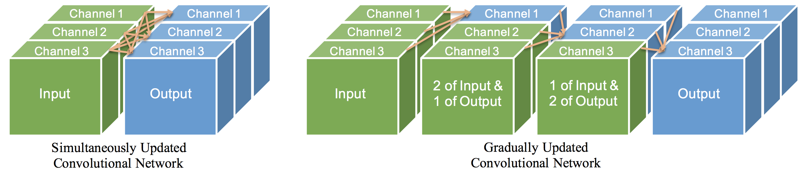

## Gradually Updated Neural Networks for Large-Scale Image Recognition

Torch implementation for gradually updated neural networks:  
[Gradually Updated Neural Networks for Large-Scale Image Recognition](http://www.cs.jhu.edu/~alanlab/Pubs18/qiao2018gunn.pdf)  
[Siyuan Qiao](http://www.cs.jhu.edu/~syqiao/), [Zhishuai Zhang](https://zhishuai.xyz/), [Wei Shen](http://wei-shen.weebly.com/), [Bo Wang](https://bowang87.weebly.com/), [Alan Yuille](http://www.cs.jhu.edu/~ayuille/)  
In Thirty-fifth International Conference on Machine Learning (ICML), 2018.

The code is built on [fb.resnet.torch](https://github.com/facebook/fb.resnet.torch).

```
@inproceedings{Gunn,
   title = {Gradually Updated Neural Networks for Large-Scale Image Recognition},
   author = {Siyuan Qiao and Zhishuai Zhang and Wei Shen and Bo Wang and Alan L. Yuille},
   booktitle = {International Conference on Machine Learning (ICML)},
   year = {2018}
}
```

### Introduction
The state-of-the-art network architectures usually increase the depths by cascading convolutional layers or building blocks.
Gradually Updated Neural Network (GUNN) presents an alternative method to increase the depth.
It introduces computation orderings to the channels within convolutional
layers or blocks, based on which it gradually computes the outputs in a channel-wise manner.
The added orderings not only increase the depths and the learning capacities of the networks without any additional computation costs, but also eliminate the overlap singularities so that the networks are able to converge faster and perform
better.



### Usage
Install Torch and required packages following [here](https://github.com/facebook/fb.resnet.torch/blob/master/INSTALL.md).
Training on CIFAR
```bash
th main.lua -netType gunn-15 -dataset cifar10 -batchSize 64 -nGPU 4 -nThreads 8 -shareGradInput true -nEpochs 300
```
For CIFAR-100, please change cifar10 to cifar100 after -dataset. Training on ImageNet
```
th main.lua -netType gunn-18 -dataset imagenet -batchSize 256 -nGPU 4 -nThreads 16 -shareGradInput true -nEpochs 120 -data [data folder]
```

### Results

Model  | Parameters| CIFAR-10 | CIFAR-100
-------|:---------:|:---------:|:----------:
GUNN-15 | 1.6M | 4.15 | 20.45
GUNN-24 | 29.6M | 3.21 | 16.69

Model  | Parameters| ImageNet Top-1 | ImageNet Top-5
-------|:---------:|:---------:|:----------:
GUNN-18 | 28.9M | 21.65 | 5.87
Wide GUNN-18 | 45.6M | 20.59 | 5.52
